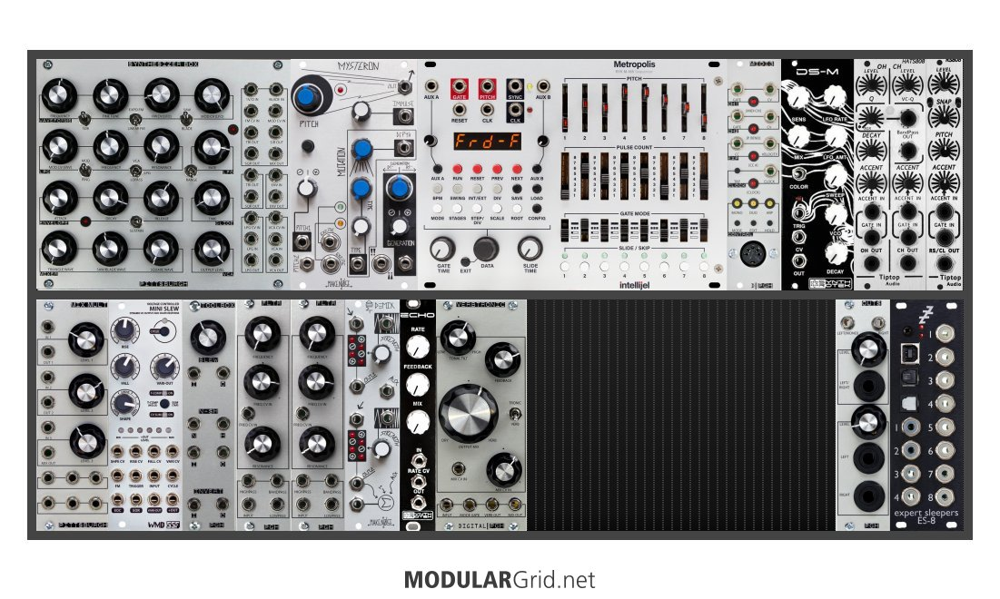

# Stetson Modular Guide
A reference for using the modular synths available to DIGA 365-366 students at [Stetson University](https://www.stetson.edu/).

## Goals

We want to record the following information for every module in our Eurorack setup.

- link to the manufacturer page
- link to the manual
- identify the course meta-category (synthesis/sampling/processing/control)
- provide a short sentence that describes the intended use
- guidance about best default settings, text and/or photo

# Top Row
## Pittburgh Synthesizer Box

- module page on manufacturer website
- PDF manual

### Description

Category?: Short sentence.

### Quick-start Steps

1. first step
2. then more steps

## MakeNoise Mysterion

- [module page on manufacturer website](http://www.makenoisemusic.com/modules/moddemix)
- [PDF manual](http://www.makenoisemusic.com/content/manuals/modDemixMANUAL.pdf)

### Description

Synthesis: This is a music synthesizer module which features 2 identical direct-coupled balanced modular circuits that may be used together or independently for Ring Modulation, VCA, Mixer, Signal multiplication, voltage controlled polarization, attenuation and more.

### Quick-start Steps

modDemix Panel Controls 
1. Signal 1 IN: signal to be processed. 
2. Carrier/ CV 1 IN: determines amplitude & phase of Signal 1 IN. 
3. Channel 1 LEDs: LED indication of signal activity in four quadrants. Vertical position represents amplitude and phase of input signal; horizontal position represents amplitude and phaseof carrier/CV input signal. 
4. Carrier/ CV 1 Strength: attenuator for Carrier/ CV IN: Normalized to +5V so that with nothing patched the associated attenuator operates as a unipolar manual control for the parameter. Range 0V-5V. 
5. Signal 1 OUT. 
6. AUXiliary INput to Summing stage: An AUXiliary IN allows for the chaining of multiple modDemix (or Optomix) units to create larger mixes. 
7. Signal 2 IN: signal to be processed. Normalled to Signal 1 OUT. 
8. Carrier/ CV 2 IN: determines amplitude & phase of Signal 2 IN. 
9. Channel 2 LEDs. LED indication of signal activity in four quadrants. Vertical position represents amplitude and phase of input signal; horizontal position represents amplitude and phase of carrier/CV input signal. 
10. Carrier/ CV 2 Strength: attenuator for Carrier/ CV IN. Normalized to +5V so that with nothing patched, the associated attenuator operates as a unipolar manual control for the parameter. Range 0V-5V.11. Signal 2 OUT. 12. SUM OUT: mix of Signal 1 OUT, Signal 2 OUT & AUX. IN.

## Intellijel Metropolis

- module page on manufacturer website
- PDF manual

### Description

Category?: Short sentence.

### Quick-start Steps

1. first step
2. then more steps

## Pittsburgh Midi 3

- [module page on manufacturer website](https://pittsburghmodular.com/midi3)
- [PDF manual](https://pittsburghmodular.com/s/midi3-manual.pdf)

### Description

Control: Converts MIDI input into CV signals.

### Quick-start Steps

1. Press and hold the MODE button for 4 seconds until the red lights flash.
2. Press the MODE button again (this time without holding) a few times until the yellow MONO light is on.
3. Connect the MIDI OUT from your keyboard to the MIDI IN jack at the bottom of the panel using a standard MIDI cable. Also make sure your keyboard is powered on. 
4. Connect the CV jack in the upper right corner of the Pittsburgh Midi 3 to the 1V/O IN jack on the Pittsburgh Synthesizer Box.
5. Connect the MIX OUT on the Synthesizer Box to the Left or Right jack on the Pittsburgh Outs.

## Synth Rotek DS-M

- module page on manufacturer website
- PDF manual

### Description

Category?: Short sentence.

### Quick-start Steps

1. first step
2. then more steps

## Tiptop Audio HATS808

- module page on manufacturer website
- PDF manual

### Description

Category?: Short sentence.

### Quick-start Steps

1. first step
2. then more steps

## Tiptop Audio RS808

- module page on manufacturer website
- PDF manual

### Description

Category?: Short sentence.

### Quick-start Steps

1. first step
2. then more steps

# Bottom Row
## Pittsburgh Mix Multi

- module page on manufacturer website
- PDF manual

### Description

Category?: Short sentence.

### Quick-start Steps

1. first step
2. then more steps

## WMD Mini Slew

- [module page on manufacturer website](https://wmdevices.com/products/vc-mini-slew)
- [PDF manual](https://cdn.shopify.com/s/files/1/0977/3366/files/MINISLEWmanual1.1.pdf?865751438778750222)

### Description

Synthesis: MINI SLEW is a feature packed function generator and voltage controlled slew limiter.

### Quick-start Steps

1. first step
2. then more steps

## Pittsburgh Toolbox

- [module page on manufacturer website](https://pittsburghmodular.com/toolbox)
- [PDF manual: Same link at manufacturer website.]

### Description

Control: A versatile module capable of performing 4 distinct jobs at once.
              - Adjustable Slew Control
              - Noise Source
              - Sample & Hold
              - Voltage Inverter
              - Module Sections

### Quick-start Steps

1. first step
2. then more steps

## Pittsburgh FLTR

- module page on manufacturer website
- PDF manual

### Description

Category?: Short sentence.

### Quick-start Steps

1. first step
2. then more steps

## MakeNoise D Mix

- module page on manufacturer website
- PDF manual

### Description

Category?: Short sentence.

### Quick-start Steps

1. first step
2. then more steps

## Synth Rotek Echo

- [module page on manufacturer website](https://store.synthrotek.com/ECHO_Voltage_Controlled_Echo)
- [Schematic (no manual available)](https://www.synthrotek.com/products/modular-circuits/echo/echo-schematic/)

### Description

Processing: This device takes the signal provided to it and repeats the signal a little later, AKA creats an echo.

### Quick-start Steps

1. Patch a signal into the ECHO at the "IN" port.
2. Patch the signal to an output outlet through the "OUT" port.
3. Use RATE to control the number of echoes per second.
4. Use FEEDBACK to control the rate of decay.  
5. Use MIX to determine the gain/strength of the echoes.  
  A. Note: MIX and FEEDBACK work closely together to adjust the potency of the echoes.

## Pittsburgh Verbtronic

- [module page on manufacturer website](https://pittsburghmodular.com/verbtronic)
- [PDF manual: None available - product discontinued - HOWEVER: the website link has a list of controls at the bottom that act as a basic manual for understanding the unit.]

### Description

Processing: this unit takes the signal provided and simulates the sound of soundwaves boucing off walls in a room, to create reverb.

### Quick-start Steps

1. Send signal to the unit by patching into the IN port.
2. Send signal out of the unit to monitors or another unit for processing via the OUT port.
   A. Use VERB OUTPUT to send 100% wet signal.  Otherwise, use the standard OUT port for a mix of dry and wet signal.
3. Use TONAL TILT to control the warmth and brightness of the sound.
4. Use FEEDBACK to control the decay and density of the reverb.
5. Use OUTPUT MIX to control the dry-wet ratio (i.e. the amount of reverb).
   A. This step may be bypassed if the VERB OUTPUT is in use.  

## Pittsburgh Outs

- module page on manufacturer website
- PDF manual

### Description

Category?: Short sentence.

### Quick-start Steps

1. first step
2. then more steps

## Expert Sleeper ES-8

- [module page on manufacturer website](https://www.expert-sleepers.co.uk/es8.html)
- [PDF manual](https://www.expert-sleepers.co.uk/es8usermanual.html)

### Description

Control & Processing: Allows you to pass audio and CV signals between your computer and the Eurorack setup.

### Quick-start Steps

1. first step
2. then more steps

